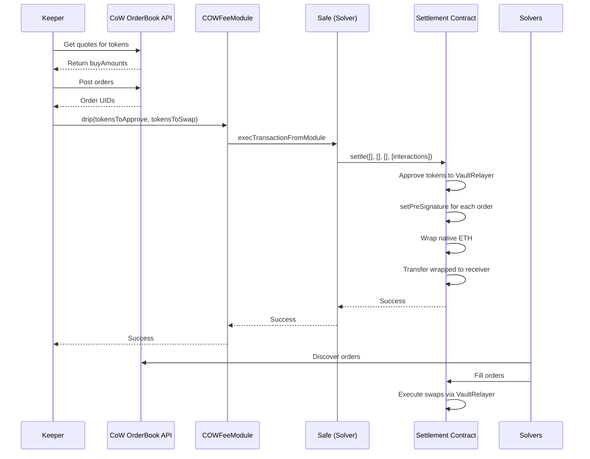

The COW Fee Module system consists of on-chain smart contracts and off-chain keeper infrastructure that work together to automate fee collection from the CoW Protocol Settlement contract.

## System Components

<CardGroup cols={2}>
  <Card title="Smart Contracts" icon="file-contract">
    On-chain components that handle approvals, presignatures, and transfers
  </Card>
  <Card title="Keeper Service" icon="robot">
    Off-chain TypeScript service that monitors and triggers fee collection
  </Card>
  <Card title="CoW Protocol API" icon="cloud">
    OrderBook API for posting orders and getting quotes
  </Card>
  <Card title="Safe Module" icon="shield-halved">
    Gnosis Safe module integration for secure execution
  </Card>
</CardGroup>

## Smart Contract Architecture

### COWFeeModule Contract

The core contract that manages fee collection operations.

**Location**: `src/COWFeeModule.sol`

#### Immutable Parameters

**From `src/COWFeeModule.sol:15-23`:**
```solidity
ISafe public immutable targetSafe;
address public immutable wrappedNativeToken;
address public immutable keeper;
bytes32 public immutable domainSeparator;
bytes32 public immutable appData;
IGPv2Settlement public immutable settlement;
address public immutable vaultRelayer;
address public immutable receiver;
uint256 public immutable minOut;
```

<Note>
All parameters are immutable for security. To change parameters, you must deploy a new module instance.
</Note>

#### Constructor

**From `src/COWFeeModule.sol:43-61`:**
```solidity
constructor(
    address _settlement,
    address _targetSafe,
    address _wrappedNativeToken,
    address _keeper,
    bytes32 _appData,
    address _receiver,
    uint256 _minOut
) {
    settlement = IGPv2Settlement(_settlement);
    vaultRelayer = settlement.vaultRelayer();
    targetSafe = ISafe(_targetSafe);
    wrappedNativeToken = _wrappedNativeToken;
    keeper = _keeper;
    domainSeparator = settlement.domainSeparator();
    appData = _appData;
    receiver = _receiver;
    minOut = _minOut;
}
```

| Parameter | Description |
|-----------|-------------|
| `_settlement` | CoW Protocol GPv2Settlement contract address |
| `_targetSafe` | Gnosis Safe address (must be a whitelisted solver) |
| `_wrappedNativeToken` | ERC20 address of wrapped native token (WETH, WXDAI, etc.) |
| `_keeper` | Address authorized to call module functions |
| `_appData` | bytes32 metadata hash for CoW orders |
| `_receiver` | Destination address for collected fees |
| `_minOut` | Minimum wrapped native token output (in wei/atoms) |

#### Key Functions

<Accordion title="drip() - Main fee collection function">
**From `src/COWFeeModule.sol:92`:**
```solidity
function drip(address[] calldata _approveTokens, SwapToken[] calldata _swapTokens) external onlyKeeper
```

This function:
1. Checks native ETH balance and determines if wrapping is needed
2. Approves tokens to VaultRelayer if needed
3. Commits presignatures for each swap order
4. Wraps native ETH if balance ≥ minOut
5. Transfers wrapped native tokens to receiver

All operations are executed atomically through Safe's `execTransactionFromModule`.
</Accordion>

<Accordion title="approve() - Token approval function">
**From `src/COWFeeModule.sol:64-69`:**
```solidity
function approve(address[] calldata _tokens) external onlyKeeper {
    IGPv2Settlement.InteractionData[] memory approveInteractions =
        new IGPv2Settlement.InteractionData[](_tokens.length);
    _approveInteractions(_tokens, approveInteractions);
    _execInteractions(approveInteractions);
}
```

Max approves tokens to VaultRelayer for future swaps.
</Accordion>

<Accordion title="revoke() - Revoke approvals">
**From `src/COWFeeModule.sol:72-88`:**
```solidity
function revoke(Revocation[] calldata _revocations) external onlyKeeper {
    IGPv2Settlement.InteractionData[] memory revokeInteractions =
        new IGPv2Settlement.InteractionData[](_revocations.length);
    for (uint256 i = 0; i < _revocations.length;) {
        Revocation calldata revocation = _revocations[i];
        revokeInteractions[i] = IGPv2Settlement.InteractionData({
            to: revocation.token,
            value: 0,
            callData: abi.encodeCall(IERC20.approve, (revocation.spender, 0))
        });
        unchecked { ++i; }
    }
    _execInteractions(revokeInteractions);
}
```

Revokes token approvals for security.
</Accordion>

<Accordion title="nextValidTo() - Deterministic order validity">
**From `src/COWFeeModule.sol:170-173`:**
```solidity
function nextValidTo() public view returns (uint32) {
    uint256 remainder = block.timestamp % 1 hours;
    return uint32((block.timestamp - remainder) + 2 hours);
}
```

Returns the timestamp that orders will be valid until (next hour boundary + 2 hours).
</Accordion>

### Safe Integration

The module integrates with Gnosis Safe as an enabled module:

**From `src/interfaces/ISafe.sol:4-15`:**
```solidity
interface ISafe {
    enum Operation {
        Call,
        DelegateCall
    }

    function execTransactionFromModuleReturnData(
        address to,
        uint256 value,
        bytes memory data,
        Operation operation
    ) external returns (bool success, bytes memory returnData);

    function enableModule(address module) external;
}
```

The Safe must:
- Enable the COWFeeModule via `enableModule(moduleAddress)`
- Be a whitelisted CoW Protocol solver (to execute `settle()` calls)

### Settlement Contract Integration

**From `src/interfaces/IGPv2Settlement.sol:4-52`:**

The module interacts with CoW Protocol's Settlement contract to:

1. **Execute interactions** via `settle()` with empty trades:
```solidity
function settle(
    address[] memory tokens,
    uint256[] memory clearingPrices,
    TradeData[] memory trades,
    InteractionData[][3] memory interactions
) external;
```

2. **Commit presignatures** for orders:
```solidity
function setPreSignature(bytes calldata orderUid, bool signed) external;
```

3. **Get domain separator** for order signing:
```solidity
function domainSeparator() external view returns (bytes32);
```

## TypeScript Keeper Architecture

### Main Entry Point

**Location**: `index.ts`

The keeper script orchestrates the entire fee collection workflow:

**From `ts/drip/dripItAll.ts:14-81`:**
```typescript
export async function dripItAll(
  config: IConfig,
  signer: ethers.Signer,
  provider: ethers.providers.JsonRpcProvider
): Promise<void> {
  const ethToWrap = await getEthToWrap(config, provider);
  const tokensToSwap = await getTokensToSwap(config, provider);
  
  const moduleContract = new ethers.Contract(config.module, moduleAbi, signer);
  if (tokensToSwap.length > 0) {
    for (let i = 0; i < tokensToSwap.length; i += config.maxOrders) {
      const toSwap = tokensToSwap.slice(i, i + config.maxOrders);
      try {
        await swapTokens(moduleContract, config, signer, toSwap);
      } catch (err) {
        console.error("Error dripping:", err);
      }
      break;
    }
  } else if (ethToWrap.gt(0)) {
    // Handles wrapping ETH even with no token swaps
    await drip({ ... });
  }
}
```

### Core Modules

<CardGroup cols={2}>
  <Card title="getTokensToSwap" icon="filter">
    **Location**: `ts/drip/getTokensToSwap.ts`
    
    Discovers tokens, fetches quotes, and filters by minOut threshold.
  </Card>
  
  <Card title="swapTokens" icon="repeat">
    **Location**: `ts/drip/swapTokens.ts`
    
    Posts orders to CoW API and calls drip function.
  </Card>
  
  <Card title="drip" icon="droplet">
    **Location**: `ts/drip/drip.ts`
    
    Constructs and sends the on-chain drip transaction.
  </Card>
  
  <Card title="getTokenBalances" icon="coins">
    **Location**: `ts/drip/getTokenBalances.ts`
    
    Implements explorer and chain strategies for token discovery.
  </Card>
</CardGroup>

### Configuration Management

**Location**: `ts/utils/readConfig.ts`

Reads configuration from:
- Command-line arguments (network, module address, etc.)
- Environment variables (PRIVATE_KEY)
- On-chain module parameters (via contract calls)

**From `ts/utils/readConfig.ts:99-118`:**
```typescript
const [receiver, wrappedNativeToken, vaultRelayer, gpv2Settlement, 
       keeper, appData, targetSafe, minOut] = await Promise.all([
  moduleContract.receiver(),
  moduleContract.wrappedNativeToken(),
  moduleContract.vaultRelayer(),
  moduleContract.settlement(),
  moduleContract.keeper(),
  moduleContract.appData(),
  moduleContract.targetSafe(),
  moduleContract.minOut(),
]);
```

## Integration with CoW Protocol

### OrderBook API

The keeper posts orders and fetches quotes using the CoW SDK:

```typescript
import { OrderBookApi } from "@cowprotocol/cow-sdk";

const orderBookApi = new OrderBookApi({ chainId });

// Get quote for token swap
const quote = await orderBookApi.getQuote({
  sellToken: token.address,
  sellAmountBeforeFee: token.balance.toString(),
  kind: OrderQuoteSideKindSell.SELL,
  buyToken: config.wrappedNativeToken,
  from: config.gpv2Settlement,
});

// Post order
await orderBookApi.postOrder(orderParams);
```

### Settlement Flow



## Security Considerations

<Warning>
**Critical Security Requirements:**

1. The target Safe **must be a whitelisted CoW Protocol solver** to call `settle()`
2. Only the keeper address can call module functions (enforced by `onlyKeeper` modifier)
3. All module parameters are immutable after deployment
4. The module has no direct custody of funds—everything flows through the Safe
</Warning>

### Access Control

**From `src/COWFeeModule.sol:36-41`:**
```solidity
modifier onlyKeeper() {
    if (msg.sender != keeper) {
        revert OnlyKeeper();
    }
    _;
}
```

### Safe Module Pattern

The module can only execute actions through the Safe:

**From `src/COWFeeModule.sol:193-202`:**
```solidity
function _execFromModule(address _to, bytes memory _cd) internal returns (bytes memory) {
    (bool success, bytes memory returnData) =
        targetSafe.execTransactionFromModuleReturnData(_to, 0, _cd, ISafe.Operation.Call);
    if (!success) {
        assembly ("memory-safe") {
            revert(add(returnData, 0x20), mload(returnData))
        }
    }
    return returnData;
}
```

## Deployment Architecture

The system can be deployed in multiple configurations:

<Tabs>
  <Tab title="Direct Execution">
    Run the keeper directly via Node.js:
    ```bash
    yarn ts-node index.ts --network mainnet --module 0x...
    ```
  </Tab>
  
  <Tab title="Docker Container">
    Deploy as a containerized service:
    ```bash
    docker build -t cow-fee .
    docker run -e PRIVATE_KEY=$PRIVATE_KEY cow-fee --network mainnet
    ```
  </Tab>
  
  <Tab title="Scheduled Job">
    Run as a cron job or scheduled task for periodic fee collection.
  </Tab>
</Tabs>

## Network Support

The system supports multiple networks with specific configurations:

**From `ts/config.ts:10-22`:**
```typescript
export const SUPPORTED_NETWORKS = [
  "mainnet",
  "gnosis",
  "arbitrum",
  "base",
  "sepolia",
  "avalanche",
  "polygon",
  "bnb",
  "linea",
  "plasma",
  "ink",
] as const;
```

Each network has specific RPC URLs, explorers, and chain IDs configured in `ts/config.ts:24-83`.
