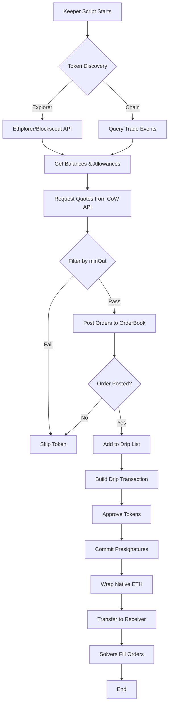

The COW Fee Module automates the collection and conversion of accumulated token fees from the CoW Protocol Settlement contract into a single wrapped native token (e.g., WETH). This page explains the complete workflow from token discovery to final transfer.

## Overview

The keeper script continuously monitors the Settlement contract for token balances and orchestrates their conversion through CoW Protocol's orderbook system. The process involves several stages:

<Steps>
  <Step title="Token Discovery">
    Identify all tokens held by the Settlement contract
  </Step>
  <Step title="Filtering & Validation">
    Filter tokens based on liquidity and minimum output thresholds
  </Step>
  <Step title="Order Posting">
    Submit swap orders to CoW Protocol API
  </Step>
  <Step title="Drip Execution">
    Approve tokens and commit presignatures on-chain
  </Step>
  <Step title="Native Token Handling">
    Wrap any native ETH and transfer proceeds to receiver
  </Step>
</Steps>

## Token Discovery Process

The keeper supports two strategies for discovering tokens held by the Settlement contract:

### Explorer Strategy

Uses external blockchain explorers to fetch token balances:

- **Mainnet**: Uses Ethplorer API (`https://api.ethplorer.io`)
- **Gnosis Chain**: Uses Blockscout API (`https://gnosis.blockscout.com`)

<Note>
The explorer strategy is the default and works faster as it doesn't require scanning blockchain events.
</Note>

### Chain Strategy

Directly queries on-chain `Trade` events from the Settlement contract:

```typescript reference
https://github.com/your-repo/cow-fee/blob/main/ts/drip/getTokenBalances.ts#L112-L159
```

This approach:
1. Fetches `Trade` events from the Settlement contract over a configurable lookback range (default: 1000 blocks)
2. Extracts unique sell and buy tokens from events
3. Uses Multicall3 to batch-fetch token decimals

**From `ts/drip/getTokenBalances.ts:112-136`:**
```typescript
const settlement = new ethers.Contract(
  config.gpv2Settlement,
  settlementAbi,
  provider
);
const tradeFilter = settlement.filters.Trade();
const currentBlock = await provider.getBlockNumber();

const chunks = chunkRange(
  currentBlock - config.lookbackRange,
  currentBlock,
  LOG_FILTER_RANGE
);
const logRanges = await Promise.all(
  chunks.map(async ([start, end]) => {
    return await settlement.queryFilter(tradeFilter, start, end);
  })
);
const logs = logRanges.flat();
```

<Warning>
The chain strategy is more resource-intensive but works on any network without requiring explorer API support.
</Warning>

## Filtering Logic

Once tokens are discovered, they undergo a three-stage filtering process:

### 1. Balance & Allowance Check

**From `ts/drip/getTokensToSwap.ts:34-51`:**
```typescript
const tokenAddresses = unfiltered.map((token) => token.address);
const [balances, allowances] = await Promise.all([
  getBalances(provider, config.gpv2Settlement, tokenAddresses),
  getAllowances(
    provider,
    config.gpv2Settlement,
    config.vaultRelayer,
    tokenAddresses
  ),
]);

const unfilteredWithBalanceAndAllowance = unfiltered.map((token, idx) => ({
  ...token,
  balance: balances[idx],
  allowance: allowances[idx],
  needsApproval: allowances[idx].lt(balances[idx]),
}));
```

### 2. Liquidity Check via Quotes API

Filters out tokens with no liquidity by requesting quotes from CoW Protocol:

**From `ts/drip/getTokensToSwap.ts:53-86`:**
```typescript
const orderBookApi = getOrderbookApi(config.chainId);
const quotes = await Promise.allSettled(
  unfilteredWithBalanceAndAllowance.map((token) =>
    orderBookApi.getQuote({
      sellToken: token.address,
      sellAmountBeforeFee: token.balance.toString(),
      kind: OrderQuoteSideKindSell.SELL,
      buyToken: config.wrappedNativeToken,
      from: config.gpv2Settlement,
    })
  )
);

const quotesFiltered = unfilteredWithBalanceAndAllowance
  .map((token, i) => ({
    ...token,
    buyAmount: BigNumber.from(
      (quotes[i].status === "fulfilled" &&
        quotes[i].value.quote.buyAmount) || 0
    )
      .mul(10000 - config.buyAmountSlippageBps)
      .div(10000),
  }))
  .filter((_, i) => quotes[i].status === "fulfilled");
```

<Note>
A configurable slippage tolerance (default: 100 bps = 1%) is applied to buy amounts to account for price movements.
</Note>

### 3. Minimum Output Filter

**From `ts/drip/getTokensToSwap.ts:88-93`:**
```typescript
const minOutFiltered = quotesFiltered.filter((token) =>
  BigNumber.from(token.buyAmount).gt(config.minOut)
);
console.log("Total tokens after filtering by minOut:", minOutFiltered.length);
return minOutFiltered;
```

Only tokens that would yield at least `minOut` wrapped native tokens are included.

## Order Posting

Successfully filtered tokens have orders posted to the CoW Protocol OrderBook API:

**From `ts/drip/swapTokens.ts:16-32`:**
```typescript
const orderBookApi = getOrderbookApi(config.chainId);

const nextValidTo = await moduleContract.nextValidTo();
const { appDataHex, appDataContent } = await getAppData();
if (appDataHex.toLowerCase() !== config.appData.toLowerCase()) {
  throw new Error(`appData mismatch: ${appDataHex} != ${config.appData}`);
}

const { failedOrders, successfullyPostedOrders, toActuallySwap } =
  await postOrders(
    orderBookApi,
    appDataHex,
    nextValidTo,
    appDataContent,
    config,
    toSwap
  );
```

Each order is a "sell" order with:
- **Sell token**: The fee token
- **Buy token**: Wrapped native token (WETH, WXDAI, etc.)
- **Valid until**: Deterministic timestamp (next 2-hour boundary)
- **Receiver**: Configured receiver address

## Drip Execution

Once orders are posted, the keeper calls the `drip()` function to commit presignatures:

**From `ts/drip/swapTokens.ts:47-66`:**
```typescript
const toApprove = toActuallySwap
  .filter((token) => token.needsApproval)
  .map((token) => token.address);

const toDrip = toActuallySwap.map((token) => ({
  token: token.address,
  sellAmount: token.balance,
  buyAmount: token.buyAmount,
}));

await drip({
  chainId: config.chainId,
  moduleContract,
  signer: signerWithProvider,
  toApprove,
  toDrip,
  confirmDrip: config.confirmDrip,
  maxFeePerGas: config.maxFeePerGas,
  maxPriorityFeePerGas: config.maxPriorityFeePerGas,
});
```

The `drip()` call on the smart contract:

**From `src/COWFeeModule.sol:92-166`:**

1. **Approves tokens** to VaultRelayer if needed
2. **Commits presignatures** for each swap order via `setPreSignature`
3. **Wraps native ETH** if balance ≥ minOut
4. **Transfers wrapped native** token to receiver

All actions are executed through the Safe's `execTransactionFromModule` interface in a single atomic transaction via `settle()` with interactions.

## Native Token Wrapping

**From `src/COWFeeModule.sol:93-106`:**
```solidity
uint256 nativeBalance = address(settlement).balance;
bool hasToWrapNativeToken = nativeBalance >= minOut;

IWrappedNativeToken wrappedNativeTokenContract = IWrappedNativeToken(wrappedNativeToken);
uint256 wrappedNativeBalance =
    (hasToWrapNativeToken ? nativeBalance : 0) + 
    wrappedNativeTokenContract.balanceOf(address(settlement));

bool hasToTransferWrappedNativeToken = wrappedNativeBalance >= minOut;
```

If the Settlement contract holds native ETH above the threshold:
1. An interaction calls `WETH.deposit()` with the native balance
2. The wrapped balance is then transferred to the receiver

## Order Validity Period

Orders use a deterministic validity period for predictability:

**From `src/COWFeeModule.sol:168-173`:**
```solidity
function nextValidTo() public view returns (uint32) {
    uint256 remainder = block.timestamp % 1 hours;
    return uint32((block.timestamp - remainder) + 2 hours);
}
```

This rounds to the next hour and adds 2 hours, ensuring orders remain valid long enough to be filled.

## Complete Flow Diagram



## Monitoring Progress

After the drip transaction is submitted, monitor settlement on CoW Explorer:

**From `ts/drip/dripItAll.ts:74-80`:**
```typescript
console.log(
  `Fee collection for chain ${config.network} initiated (${
    tokensToSwap.length
  } orders). Expecting proceeds of ${expectedUnitsFormatted} ${
    await buyTokenContract.symbol()
  }!\n\nFollow the progress at ${
    networkSpecificConfigs[config.network].explorer
  }/address/${config.gpv2Settlement}`
);
```

Visit the explorer link to see order fills and final proceeds.
